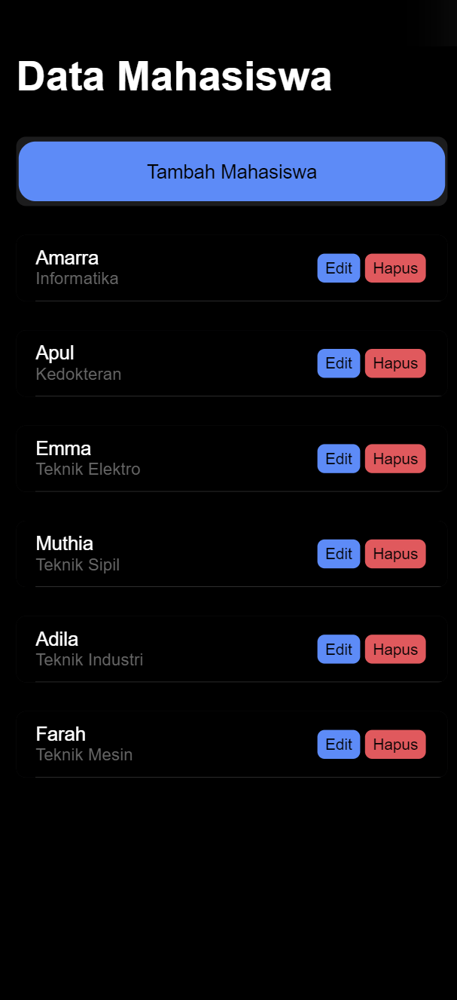
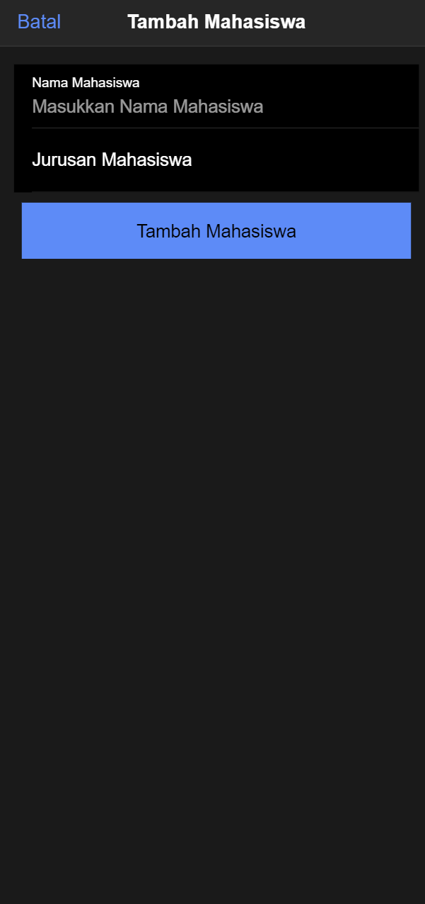
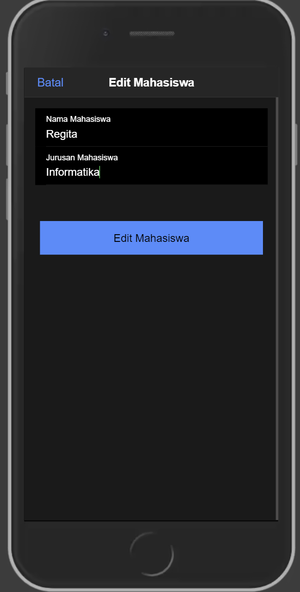
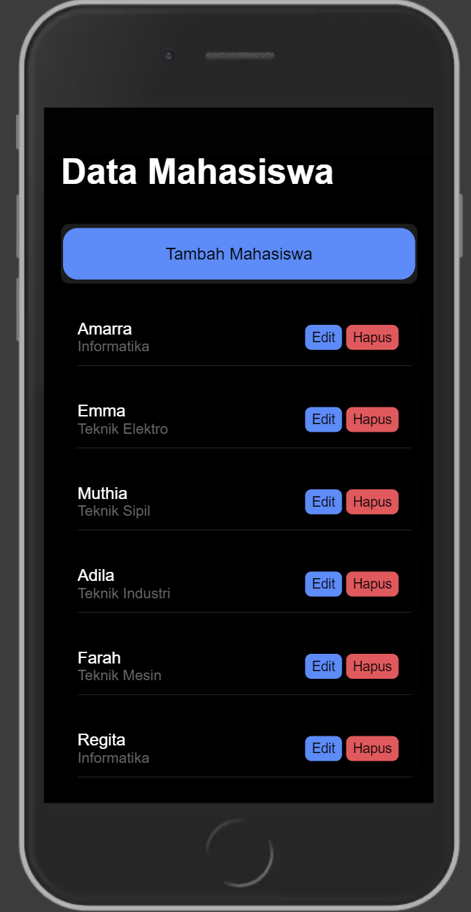
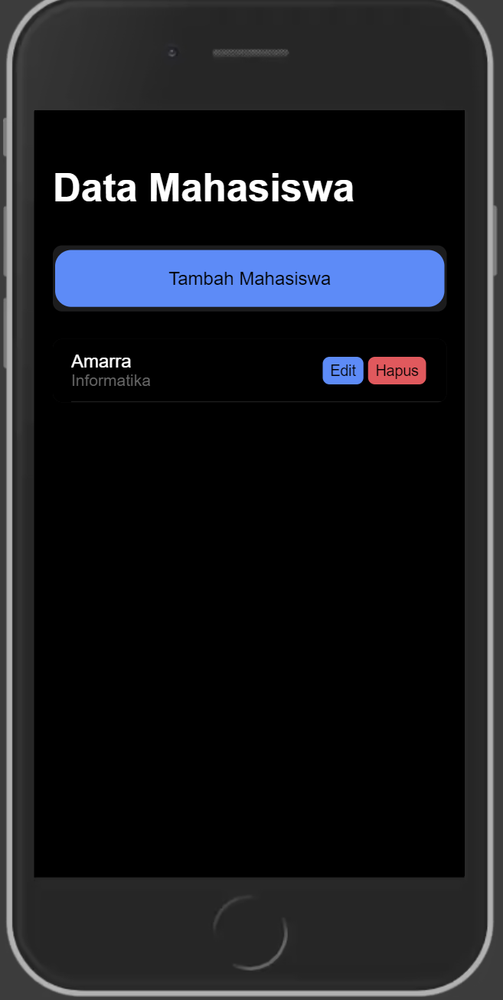

Proses CRUD

1. **Read Data**
Method `getMahasiswa()` adalah fungsi yang dijalankan saat komponen dimuat pertama kali melalui `ngOnInit()` untuk mengambil data mahasiswa dari API `tampil.php` menggunakan `ApiService`. Dalam prosesnya, method ini mengirim permintaan GET ke `tampil.php` untuk memperoleh data mahasiswa yang tersedia di server. Jika permintaan berhasil, respons yang diterima disimpan dalam variabel `dataMahasiswa`, sehingga data tersebut bisa ditampilkan di halaman. Namun, jika permintaan mengalami kegagalan, pesan error akan dicatat di konsol untuk memudahkan debugging atau pemantauan masalah.

2. **Tambah Data**
Method `tambahMahasiswa()` digunakan untuk menambahkan data mahasiswa baru ke dalam sistem. Prosesnya dimulai dengan pengecekan apakah field `nama` dan `jurusan` sudah diisi; jika tidak, data tidak akan dikirim. Setelah validasi ini, dibuat objek `data` yang berisi `nama` dan `jurusan` yang diambil dari input pengguna. Objek ini kemudian dikirim sebagai permintaan POST ke endpoint `tambah.php` melalui `ApiService`. Jika penambahan data berhasil, beberapa tindakan dilakukan: form di-reset agar kosong kembali, data mahasiswa yang baru ditampilkan dimuat ulang, modal (dialog) ditutup, dan pesan sukses dicetak di konsol untuk memberi tahu bahwa proses berhasil. Namun, jika ada kesalahan dalam pengiriman atau jika field masih ada yang kosong, pesan error akan ditampilkan di konsol, memungkinkan pengguna atau pengembang untuk mengetahui ada kendala pada proses penambahan data.

3. **Edit Data**
Method `editMahasiswa()` digunakan untuk mengedit data mahasiswa yang sudah ada berdasarkan ID mahasiswa yang spesifik. Proses dimulai dengan pembuatan objek `data` yang berisi informasi `id`, `nama`, dan `jurusan`, yang diambil dari form yang telah diisi atau diperbarui oleh pengguna. Objek ini kemudian dikirim sebagai permintaan POST ke endpoint `edit.php` menggunakan `ApiService` untuk memperbarui data mahasiswa di server. Jika proses edit berhasil, beberapa langkah diambil: form di-reset agar kosong kembali, data mahasiswa yang telah diperbarui dimuat ulang di halaman, modal ditutup, dan pesan sukses ditampilkan di konsol untuk konfirmasi. Namun, jika proses gagal, pesan error akan dicatat di konsol untuk membantu dalam penanganan kesalahan atau debugging.

4. **Hapus Data**
Method `hapusMahasiswa(id: any)` digunakan untuk menghapus data mahasiswa berdasarkan ID yang diberikan. Prosesnya dimulai dengan mengirimkan permintaan DELETE ke endpoint `hapus.php?id=` disertai ID mahasiswa yang ingin dihapus, menggunakan `ApiService`. Jika penghapusan berhasil, method ini akan memuat ulang data mahasiswa untuk memperbarui tampilan agar mencerminkan penghapusan tersebut, dan pesan sukses dicetak di konsol sebagai tanda bahwa operasi berhasil. Namun, jika terjadi kegagalan selama proses ini, pesan error akan ditampilkan di konsol untuk memberikan informasi mengenai adanya kesalahan atau masalah dalam proses penghapusan data.

**Fungsi Tambahan**
Pengelolaan modal dalam kode ini diatur melalui method `openModalTambah()` dan `openModalEdit()`, yang berfungsi untuk membuka dan menyiapkan modal khusus untuk proses penambahan atau pengeditan data mahasiswa. Saat pengguna membuka modal tambah atau edit, form diatur sesuai dengan kebutuhan masing-masing proses. Method `cancel()` digunakan untuk menutup modal tersebut dan sekaligus mereset data form agar siap digunakan kembali. Reset form ini dilakukan dengan `resetModal()`, yang mengosongkan field `id`, `nama`, dan `jurusan`, sehingga setiap kali form dibuka, pengguna memulai dengan field kosong. Kode ini menggunakan `ApiService` sebagai perantara untuk berkomunikasi dengan endpoint backend, memfasilitasi setiap operasi CRUD (Create, Read, Update, Delete). Dengan penggunaan modal, form untuk menambah atau mengedit data mahasiswa ditampilkan dengan cara yang interaktif dan terorganisir, sehingga memudahkan pengguna dalam pengelolaan data.